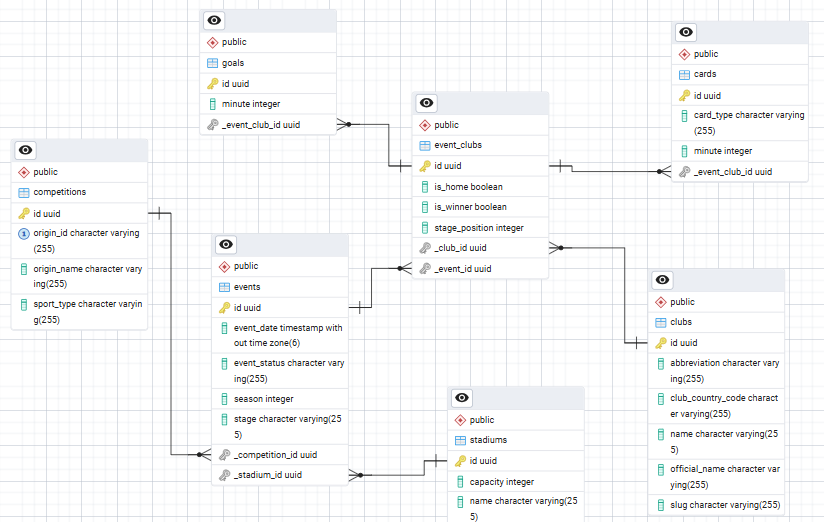

# Sportradar_BE

## 1. Project Overview
This is a web app to manage sports events. You can see, add, and filter matches for sports like football or basketball. I made this for the **Sportradar Coding Academy** recruitment task.

**What it does:**
* **Events List:** Shows matches with date, time, stadium, and the final score.
* **Add Stats:** You can add goals and cards (with minutes) when you create a new match.
* **Auto-Score:** The system automatically calculates who won based on the goals you enter.
* **Filters:** You can search for matches by sport or date.
* **API Docs:** It has a Swagger UI where you can test all the backend links easily.

## 2. ERD Diagram
The database is built using **3rd Normal Form (3NF)** to keep everything organized and avoid repeat data.

## 3. How to Run
The project uses Docker, so it is very easy to start with one command.

    
    docker-compose up --build -d
    

### Requirements:
* Docker
* Docker Compose

### Links:
* **Frontend:** [http://localhost:3000](http://localhost:3000)
* **Swagger API:** [http://localhost:8080/api/v1/swagger-ui/index.html](http://localhost:8080/api/v1/swagger-ui/index.html)
* **pgAdmin:** [http://localhost:15433](http://localhost:15433)
* **Note:** You don't need to type a password for the database. The login is **automatic** because of a special script in Docker.

## 4. My Decisions and Settings

### Database (Tasks 1 & 2)
* **3NF:** I put stadiums, clubs, and leagues in different tables so the data stays clean.
* **Foreign Keys:** I used an underscore prefix (like `_stadium_id`) as requested.
* **Match-Club Link:** I used an `event_clubs` table to connect teams to matches and track who is the home team.

### Backend (Task 3)
* **SQL Performance (N+1):** I used LEFT JOIN FETCH in the EventRepository to eagerly load primary relations (Clubs and EventClubs) in a single query. For nested collections like goals and cards, I implemented Batch Fetching. This hybrid approach avoids MultipleBagFetchException (which occurs when fetching multiple collections with JOIN FETCH) and prevents Cartesian Product issues, while keeping the number of queries low and predictable (typically 3 queries). I fetch each collection (goals and cards) in separate queries using a facade layer.
* **Lazy Loading** All associations are configured as LAZY by default to avoid unnecessary data loading and maintain control over fetching strategies.
* **Validation:** I added an `EventValidator` so you can't save a finished match with a date in the future.
* **Sample Data:** The app uses a `DatabaseSeeder` to automatically add some clubs and matches when you start it for the first time.

### Frontend
* **Vanilla JS:** I used basic JavaScript without any big frameworks to keep the frontend simple and fast.
* **Dynamic Forms:** When you add a match, you can click a button to add as many goals or cards as you want.

### Trade offs
* Due to time constraints, I focused primarily on backend architecture, data modeling, and query performance. The frontend is intentionally kept simple to demonstrate end-to-end functionality.

* Instead of fetching all collections in a single query, I used multiple queries (batch fetching) to avoid MultipleBagFetchException and Cartesian Product issues. This increases the number of queries slightly, but guarantees predictable performance and avoids data duplication.

* I chose a layered architecture (controller → service → facade → repository) to improve separation of concerns and testability. For this task, a simpler structure would be sufficient, but this approach makes the application easier to extend in the future.

* Validation is handled at the application layer (EventValidator) instead of relying only on database constraints. This allows more complex business rules but introduces additional code that must be maintained.

* Swagger/OpenAPI was added to simplify API testing and improve usability instead of relying solely on tools like Postman.

* The most critical business rules (such as event validation and winner calculation) are covered with unit tests to ensure correctness of core logic.

* Unit tests were prioritized (especially for validation and domain logic), while controller tests are skipped.

* The current structure allows easy extension of test coverage (e.g. adding integration tests or expanding tests to other domains like Club or EventClub).

* Filtering is implemented using JPA Specifications, which allows building dynamic and composable queries based on optional parameters (e.g. sport, date). This approach improves flexibility and keeps the repository layer clean compared to writing many custom query methods.

* Pagination is supported to limit the number of results returned from the database. This prevents loading large datasets into memory and improves performance for larger data volumes.

* The combination of pagination and specifications ensures that filtering is efficient and scalable, while still keeping the API simple and extensible.

---
*Created for Sportradar Coding Academy.*